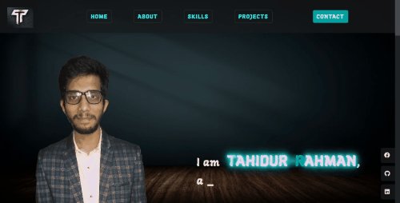

I'm Tahid from Bangladesh and learning web development since January, 2020. I enjoy building projects, solving problems and making my imagination alive with code. I'm always hungry to learn something new.

## Preview


### [Click here to watch live](https://dev-tahid.web.app/)

## How to use
1. Clone/Download the repo.
2. Run  ``` npm install ```.
3. Change the values in ```src/resumeData.js``` to suit your use-case.
4. Run ```npm start``` to spin the up the local dev server port 3000.(http://localhost:3000).
5. Make required changes in ```src/resumeData.js``` to suit your needs.
